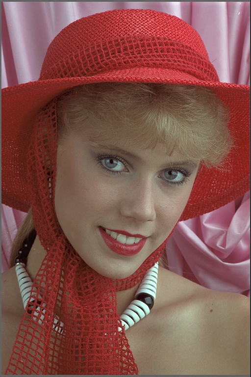

# Scramb.py
Scramb.py is a region based JPEG Image Scrambler

## Main features
- Scramb.py can scramble images *regions*. So you can e.g. scramble only the face of a person.
- All you need to descramble the image is encoded in a data „snake“ around the image. The scrambled image is thus a bit wider as the original.
- You can select different scramble modes.
  - When you slightly scramble a region, a thumbnail of the image can still be recognized.
  - If you use ghe heavy scrambler, you cannot guess the content.
- You can set a password
- You can include short text messages that will show up upon descramble
- Easy to use: Windows Drag & Drop descramble
- Survives multiple re-encodings of an image down to JPEG quality around 30 something, when the image gets ugly and blocky still chances that they decode
- Does not depend on any meta data within the JPEG file, as these are normally completly stripped by all major social media sites.

## Use cases
- Offend the easily offended *less*: Upload pictures to sites like Twitter, Facebook, DeviantArt etc. (esp. Social Media) that normally trigger people to report these *despite* being okay and according to TOS of the site.
- Upload a pic as a teaser but give away the password only to a small section of people

## Image quality:
Slight scramble will produce a near identical descrambler image.
Scramb.py scrambles 8x8 blocks to best encounter effects of jpeg artifacts.
Nevertheless the heavy scrambler will produce a grid like structure in bright (esp. red/blue) regions of the descrambled image. This happens because of color subsampling in JPEG by the factor 2.

You can circumvent that with the -2 option, blowing up the image by 2x. While descrambling, it will automatically be reduced to the original size.

## Regional scrambling
The main advantage of this scrambler in comparison to other image scrambles is that it can scramble only parts of an image.
For that you provide the scrambler also a black and white image where you marked the regions you want to scramble in white.
You can easily create such an image with Photoshop, GIMP or even Windows Paint. Just be carefull not to overwrite your original image with Paint ;-D

## Password protection
You can set a password
be aware that the password system and the used Random Number Generator are nowhere near security and not tested for that application.
Consider the password system to be like a cheap padlock.

## Text
You can add a short text to be shown while descramble
This text is *not* password protected

## Scramb.py - Logo
A small logo is added to help people find this descrambler „scrambled by Scramb.py“
You can of course switch that off if you wish

## Drag & Drop
Windows use is easy for descramble
(Scramble needs commandline;-)

## Backdoor Free Code
Code is easy to follow so feel free to check it for backdoors. You can even delete the encoded logo

## Full resolution examples

### Image region
#### Original

#### Scramble mask

#### Output, slightly scrambled

### Full image
#### Original

#### Output, heavy scramble

# Notes
Sample Images from http://r0k.us/graphics/kodak/index.html

