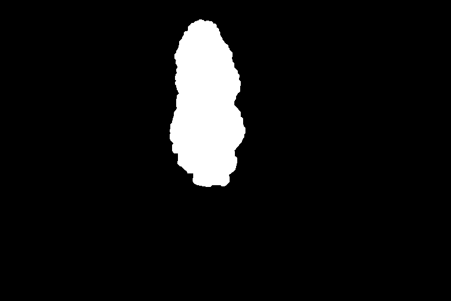

# Scramb.py
**Scramb.py** is a region based JPEG Image Scrambler and Descrambler written in Python for End-to-End-Encrypted (E2EE) Image distribution through unaware channels.

- [Installation Windows & Linux](#installation)
- [Usage](#usage)
- [Options](#options)
- [Details](#details)
- [Examples](#examples)

## Use cases
- Offend the easily offended *less*: Upload pictures to sites like Twitter, Facebook, DeviantArt etc. (esp. Social Media) that normally trigger people to report these *despite* being okay and according to TOS of the site.
- Upload a pic as a teaser but give away the password only to a small section of people
- Have a gallery with images showing no sign of a second meaning and distribute the patch images separatly.
- Use as End-to-End-Encryption E2EE method for websites, messaging systems, chats, email, etc.
- Image Hosts / Websites / Chat & Messaging services are left unaware of image content
- Prevent and circumvent automated scanning / image hashing / photo hashing and machine learning / AI recognition of images. Scrambpy helps bringing back the effort of scanning and analysing images to a manual and thus expensive, labor intensive level. It thus helps to prevent mass survillance.

## Main Features
- Scramb.py can scramble images *regions*. So you can e.g. scramble only the face of a person.
- All you need to descramble the image is encoded in a data „snake“ around the image. The scrambled image is thus a bit wider as the original.
- You can select different scramble modes.
  - When you slightly scramble a region, a thumbnail of the image can still be recognized.
  - If you use the heavy scrambler, you cannot guess the content.
- You can set a password
- You can include short text messages that will show up upon descramble
- Easy to use: Windows Drag & Drop descramble
- Survives multiple re-encodings of an image down to JPEG quality around 30 something, when the image gets ugly and blocky still chances that they decode
- You can create patch images to separate transported images from their recreation metadata
- Does not depend on any binary meta data within the JPEG file (EXIF, XMP, IPTC), as these are normally completly stripped by all major social media sites.

### Passwordless mode with region scramble
*Prevent reporting of images by casual users and automated scanning*

1. A publisher wants to distribute an image E2EE and uses scrambpy to regional scramble this image.
He uploads the scrambled image to a website

2. A consumer can download this image and descramble it with scrambpy

3. The website uses content match systems to automatically match certain images. Both systems will fail and thus the image is not automatically reported / flagged.
    - The photo hashing system fails because the scrambled image creates totally different hashes
    - The machine learning system which tries to recognize "a woman" fails for same reason
    Weak spot: If the content match system uses scrambpy, it can descramble the image and then do hashing and matching

4. A casual viewer scrolls by the image and does not care, thus preventing triggering the user so that he/she reports the image.

5. (Malign Case) An informer can also use scrambpy and now reports the image

### Password mode with full scramble
*Prevent automated scanning and manual reporting of images with password*

1. The publisher scrambles the image with a password and informs the informed consumer about the password through a secure channel. They exchange the image E2EE through a normal website.

2. The website uses content match systems to automatically match certain images. Both systems will fail and thus the image is not automatically reported / flagged. This time, the system will also fail if the system uses scrambpy automatically, because the password is missing.

3. A casual viewer and an informer cannot see the scrambled image.

4. An informer cannot descramble the image without the correct password. He/She then still gets a scrambled image.

### Patch Mode
*Prevent reporting of images by casual users (or also informers if password is used) and automated scanning and distribute fully disguised image*

1. The publisher creates a disguise image without certain content.

2. The publisher also creates the hidden image with certain content (a lighthouse in this case).

3. Optional: Publisher and consumer exchage a password via a secure channel

4. The publisher uploads the disguised image in full view and the patch image. He/She may upload both images to different websites.

5. The websites use content match systems to automatically match certain images. Both systems will fail on both websites and thus the image is not automatically reported / flagged.
- The website on top with the disguised image has absolutly no reason to detect anything (100% Save)
- The website on the bottom does not have the full image information to detect anything. There is a weak spot when using the embedded thumbnail and automated scrambpy. If a password is used, this does not work anyway.

6. The casual viewer does not care and thus does not report

7. If no password is used, the informer can collect both images (disguise + patch) and then report the hidden image.

8. If a password is used, the informer cannot descramble the image without the correct password. He/She then still gets the disguise image with scrambled content patched in.

### Example: Scramble

*In this example, only Lenna's face was scrambled and the scrambled image is password protected. You can actually try the example images in this repo with scramb.py yourself!*
*Also, people get offended when Lenna is used (although, now we also have Fabio, which I use as a Black/White Test Image!... so, Lenna is scrambled here in this repo :-)*

### Example: Patch

*This is a patch image. Scramb.py can create these to separate transported images from their recreation metadata. The patch image is then used to "patch in" the scrambled image blocks next to the thumbnail you see here.*

# Installation

## Windows
scramb.py is written and runs in Python, so you have to install the Python interpreter and one Python module (Pillow).
1. Install Python 3 for Windows [https://www.python.org/downloads/windows/](https://www.python.org/downloads/windows/)
2. Download scramb.py Script, it should look like this:

3. Install Pillow module, you can do this manually or let the scramb.py Script do this:
   - **via Script:** Run scramb.py with a double click and if prompted, press `y` to install Pillow
   - **manually** locate `pip.exe` in your Python installation folder and run `pip.exe install Pillow` in a commandline

## Linux

1. Install Python 3 if not already present (Ubuntu, Raspberry OS etc should have Python 3 installed already).
2. Download scramb.py Script
3. If not present, install Pillow with `pip install Pillow`
4. Make the script executable `chmod +x scramb.py`

# Usage

## Descramble

### Drag & Drop Descramble (Windows)
To descramble an image, download it **in full resolution** and drag & drop it onto the script.

- If the image is password protected, the console window will stay open and ask you for a password:

- At this point you cannot descramble patch-mode images with drag & drop (the one where you input 2 images). You then have to use the commandline.

### Descramble (Windows)
To descramble an image, download it **in full resolution** and use its path as one of the arguments
`python.exe scramb.py <inputfile.jpg>`

`python.exe scramb.py -i <inputfile.jpg> -o <outputfile.jpg>`

### Descramble (Linux)
To descramble an image, download it **in full resolution** and use its path as one of the arguments
`./scramb.py <inputfile.jpg>`

`./scramb.py -i <inputfile.jpg> -o <outputfile.jpg>`

### Patch Mode Descramble (Windows)

`python.exe scramb.py -i <patchfile> -d <disguisefile> -o <outputfile.jpg> [OPTIONS]`

### Patch Mode Descramble (Linux)

`./scramb.py -i <patchfile> -d <disguisefile> -o <outputfile.jpg> [OPTIONS]`

## Scramble

### Scramble (Windows)
At this moment, drag & drop scrambling is not possible. You have to use the commandline or write a short batch file.

`python.exe scramb.py -i <inputfile> [-m <mask.png/.jpg>] -o <outputfile.jpg>  [OPTIONS]`

You must use `-m` and/or `-s` for scramb.py to detect that you want to scramble.

### Scramble (Linux)

`./scramb.py -i <inputfile> [-m <mask.png/.jpg>] -o <outputfile.jpg>  [OPTIONS]`

You must use `-m` and/or `-s` for scramb.py to detect that you want to scramble.

### Patch Mode Scramble (Windows)

`python.exe scramb.py -i <inputfile> -d <disguisefile> -m <maskfile> -o <patchfile.jpg> [OPTIONS]`

### Patch Mode Scramble (Linux)

`./scramb.py -i <inputfile> -d <disguisefile> -m <maskfile> -o <patchfile.jpg> [OPTIONS]`

## Calculate Residue
`scramb.py -r <imagefile1.jpg> <imagefile2.jpg>`

## Options
### -x <number> -y <number> -z <number>
Specific parameter for the chosen scrambler, see table below.

### -s <scrambler>
The scrambler to be used

scrambler | x | y | z | What it does
--- | --- | --- | --- | ---
`matrix` | seed | turn percentage (10=10%, 100=100%, 170=170%) | - | turns a group of 2x2 blocks clockwise. Does not work on lonely pixels.
`medium` | seed | rounds | distance | moves a block a maximum of *distance* left or right. Runs over all blocks *rounds* times.
`heavy` | seed | rounds | - | moves every block somewhere else *rounds* times

  
### -d  
`-d <disguiseimage.jpg>

With `-d` scramb.py will take 3 images as input:
- -i original image
- -d disguise image
- -m mask

scramb.py will then generate a patch-image.

### -2
Blowup image by 2x
### --quality=
`--quality=10..100`

JPEG Output Quality 0-100, 100=best, default=100
### --no-logo
do not include Logo in Image
### -t
`-t "<Text>"`

Embed text to show when descrambling (max. 400 chars)
### --silent
Do not pause on descramble for displaying text
### -p
Scramble with password (ask for it)
### --password=
`--password=<password>`

Scramble with `<password>`

Caution: it's then in your console history! Use `-p` instead!
### --stealth
Hide password use from generated image. You must run descrambling with `-p` or `--password` option then! Descrambling without these options will otherwise not promt for a password and the descrambled image is still scrambled (in a different way).
### --overwrite
Overwrite output file when it exists

# Details

## Image quality
Slight scramble will produce a near identical descrambler image.
Scramb.py scrambles 8x8 blocks to best encounter effects of jpeg artifacts.
Nevertheless the heavy scrambler will produce a grid like structure in bright (esp. red/blue) regions of the descrambled image. This happens because of color subsampling in JPEG by the factor 2 and in a scrambled image, blocks of brigthness and darkness now lie next to each other when in the original image they do not.

You can circumvent that with the `-2` option, blowing up the image by 2x. While descrambling, it will automatically be reduced to the original size.

## Regional scrambling
The main advantage of this scrambler in comparison to other image scrambles is that it can scramble only parts of an image.
For that you provide the scrambler also a black and white image where you marked the regions you want to scramble in white.
You can easily create such an image with Photoshop, GIMP or even Windows Paint. Just be carefull not to overwrite your original image with Paint ;-D

## Patch-mode Scrambling
Scramb.py can create a "patch" for an image to hide blocks and corresponding reconstruction data in a second image. This way, a "disguise" image can freely be distributed and later be patched with the patch-image.

In the following example, the lighghouse was edited out with a photo editing software.
As a result, we want to distribute the edited version (without the lighthouse) **and** the patch image, so that Scramb.py users can recreate the original image with the lighthouse.

### Original image with -i
With parts you want to disguise.

### Disguise image with -d
An image where you edited something out or, if e.g. rendered, you changed something.

(No, scramb.py cannot do this for you ;-) it's not an artificial intelligence multitool ;-) you have to use Gimp or Photoshop etc )
### Mask with -m
Showing what will be switched / what is hidden.
  

### Resulting patch-image
With this patch-image and the disguise image (the one *without* the lighthouse), scramb.py can recreate the one *with* the lighthouse.
  

## Seed based scrambling
All of Scramb.py's Scrambling Algorithms use a Seed to generate pseudo random numbers. This is essential so that when descrambling, Scramb.py can create the substitution map that was used for scrambling.  

## Password protection
You can set a password. Be aware that the password system and the used Random Number Generator are nowhere near security and not tested for that application.
Consider the password system to be like a cheap padlock.

## Text
You can add a short text to be shown while descramble
This text is *not* password protected

## Scramb.py - Logo
A small logo is added to help people find this descrambler „Scrambled with Scramb.py“.

You can of course switch that off if you wish

## Drag & Drop
Windows use is easy for descramble

(Scramble needs commandline;-)

## Backdoor Free Code
Code is easy to follow so feel free to check it for backdoors. You can even delete the encoded logo.

# Examples

### Image region
#### Original

#### Scramble mask

#### Output, slightly scrambled

### Full image
#### Original

#### Output, heavy scramble

### Patch-image

# Changelog
View [changelog](CHANGELOG.md)
  
# Notes
Sample Images from
  
http://r0k.us/graphics/kodak/index.html
  
https://en.wikipedia.org/wiki/Lenna

